# Weblog

> [!NOTE]
> Some entries with suffix means commit code.

## 2026-06-08 02:51 - first estimator prototype (`5e7dcbb`)

At the beginning of the project, I was exploring a tool that would output stress levels based on a player's current performance in Tetris, intended for use in another of my game projects. However, I ultimately did not proceed with it, and the remaining files from this stage are merely remnants of that initial phase.

But the strange thing is that the dependencies haven't changed much, so the project initialization still exists.

## 2026-06-08 17:06 - basic model dependencies (`8c761a2`)

The environment gained basic model-related dependencies, including an early split between normal and GPU-oriented setup. That discussion mattered later because the project briefly considered a faster GPU path, then returned to a lighter CPU path after checking the real workload.

## 2026-06-17 18:34 - p5 prototype translated into Python runtime (`28b8b83`)

At this stage, I shifted my focus to the optimization (or rather, comparative research) of the AI for another existing project (referring to generative biological behavior); therefore, I began preparing to port my previous project into a Python environment.

The archived playable prototype under `archive/frontend` came from a p5.js version of the project. The current Python runtime was produced by using an LLM, which has been claimed in README, to translate that JavaScript prototype into a Python simulation and research stack.

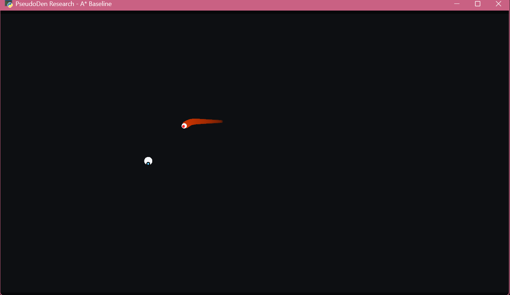
Fig.1 Early Python runtime with the A* baseline active

This commit also made A* the first serious baseline. A* gave the later ML work a stable teacher, a known pathfinding reference, and a clear comparison target.

## 2026-06-17 20:34 - dev mode and obstacle map (`d6bfa2b`)

The interactive app gained a richer development view with obstacle maps, visual debugging, and a right-side status panel. This panel became important because it kept the experiment readable while the model work grew.

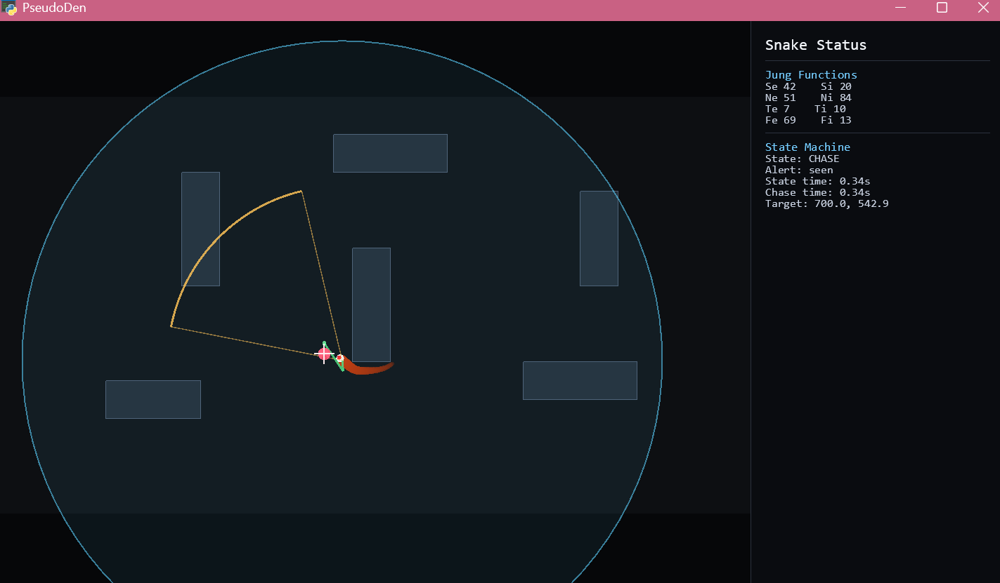
Fig.2 Development panel showing Jung functions, state-machine state, obstacles, and path debug lines

The UI direction was then narrowed. The panel now focuses on Jung function values and the state machine.

## 2026-06-17 21:58 - first ML strategy (`ca4405f`)

The first scikit-learn-backed ML strategy entered the runtime. The early model plan started with a simple supervised imitation idea: collect A* teacher choices, train a classifier, and compare the learned policy against the planner.

`DecisionTreeClassifier` was considered first because it is explainable and beginner-friendly. The project later moved toward an incremental CPU-friendly classifier because route training needs repeated updates and the per-frame input is small.

I also tried using PyTorch CUDA to leverage my computer's GPU, but I ultimately abandoned it for two reasons: 1. The dependencies were too large (over 1 GB), making the project bloated; 2. The performance improvement was not significant because there were very few concurrent tasks.

## 2026-06-17 23:31 - headless auto-run (`d52b3c2`)

The project added headless operation, meaning the simulation can run without opening the interactive window. For training and evaluation, this is the turning point: the computer can run many episodes, write logs, and produce comparable data without manual play.

Headless mode also makes the research easier to repeat. Instead of judging one visible run by eye, later steps can compare routes, maps, and metrics from stored CSV logs.

## 2026-06-18 11:12 - model evaluation loop (`10cb4b8`)

The model gained stronger evaluation support. The simulation began recording more useful per-frame and per-episode values, and tests expanded around the research core.

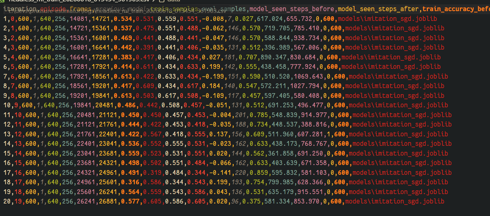
Fig.3 Training log rows made the model changes visible instead of relying on one visible run

At this stage, I began to consider matters related to model optimization and evaluation: accuracy alone is not enough, because the research goal is the experiential difference between A* and ML.

## 2026-06-18 13:13 - analysis and tuning (`903c87a`)

This commit added the analysis and tuning layer: result processing, ML logs, tuning candidates, and comparison metrics. It was the first major step toward answering the research question with data instead of screenshots.

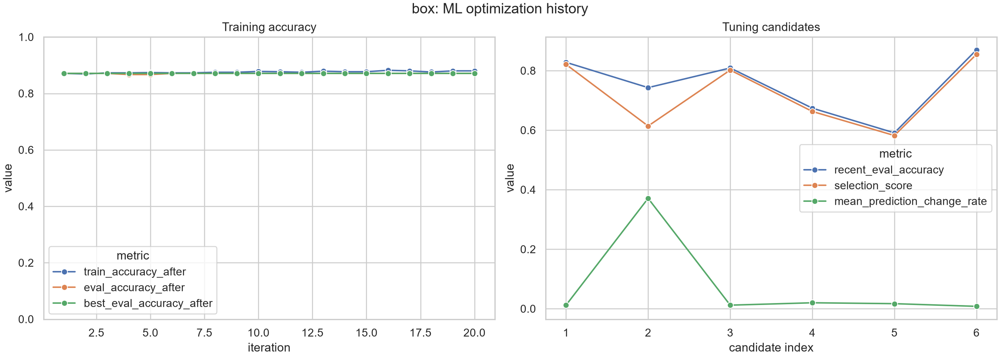
Fig.4 Training and tuning curves used to decide whether the frozen model was stable enough for comparison

The best accepted model at this stage used `local_geometry_v2`, `15` features, `SGDClassifier`, `1280` training samples, `256` eval samples, and a best eval accuracy of `0.871`.

The tuning strategy balanced model accuracy against behavior quality. The key idea was to avoid selecting a model that scores well on one log but loses the broader pursuit behavior.

## 2026-06-18 14:03 - more training (`a629e81`)

The next commit tightened the tuning settings and continued improving the model. This was a smaller code change, but an important research step: after the system can train, the next question is whether each parameter change actually improves the accepted metrics.

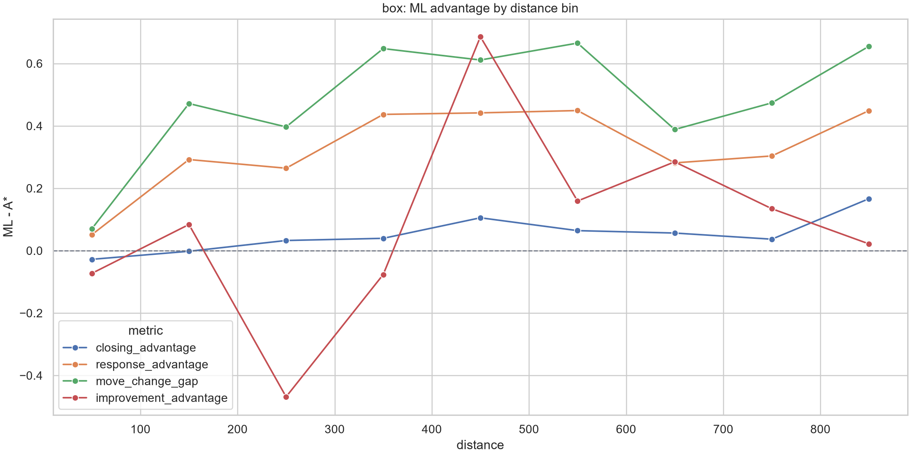
Fig.5 Box-route distance bands show where ML gains or loses advantage against A*

The first strategy comparison showed the core tradeoff:

| strategy | avg distance | caught | teacher agreement | move change | closing rate | avg path nodes | avg path distance |
| --- | ---: | ---: | ---: | ---: | ---: | ---: | ---: |
| A* | 434.94 | 9 | 1.000 | 0.019 | 0.443 | 5.37 | 201.56 |
| ML | 475.12 | 4 | 0.489 | 0.595 | 0.487 | 2.00 | 41.95 |

The reading was direct: A* stayed better at reliable capture, while ML showed stronger local reactivity and slightly higher closing pressure.

## 2026-06-18 16:49 - route-split training run

The model was trained on multiple preset routes: `box`, `zigzag`, and `orbit`, then tested on the held-out `diagonal_sweep` route. This reduced the risk that repeated runs on one route would simply overfit the model to that route.

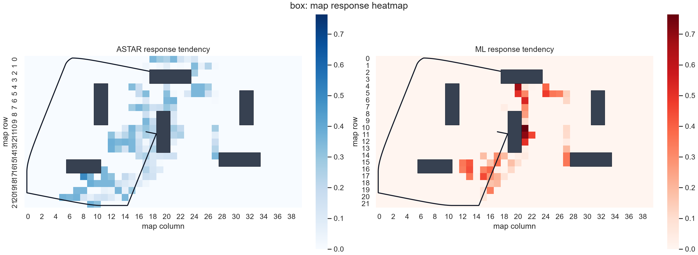
Fig.6 Box-route response map showing where each strategy reacts most strongly

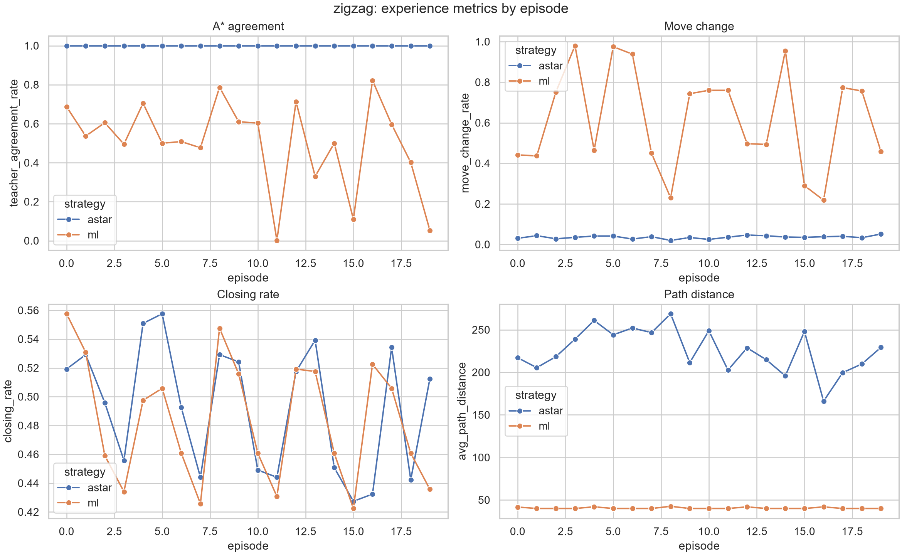
Fig.7 Zigzag experience lines expose the higher action-change style of the ML policy

The route split used `20810` train samples, `7157` validation samples, `6716` held-out test samples, and `256` random-map eval samples.

| iteration | validation accuracy | test accuracy | random accuracy | decision |
| ---: | ---: | ---: | ---: | --- |
| 0 | 0.6489 | 0.6371 | 0.8633 | baseline active model |
| 1 | 0.7542 | 0.7341 | 0.8516 | promoted deploy model |
| 2 | 0.7319 | 0.7166 | 0.8164 | not selected |
| 3 | 0.7808 | 0.7692 | 0.8125 | route-best only |

The strongest route-only model was kept separately, but not promoted as the active model because it gave up too much broad behavior. The deploy model was selected because it improved route validation and held-out test accuracy while keeping random-map accuracy within the safety threshold.

## 2026-06-18 18:06 - route visual analysis

The route visual analysis compared A* and ML on `box`, `zigzag`, `orbit`, and `diagonal_sweep`. The goal was to inspect not only success, but also response style, action change, and distance-band behavior.

The four response maps below use the same visual language, so the route shapes can be compared directly. `box` and `orbit` make the player move around broad loops, `zigzag` creates frequent turning pressure, and `diagonal_sweep` is the held-out route used to check whether the model still reacts sensibly outside the training routes.

Fig.8 Box-route response map showing the broad loop used in both training and strategy comparison

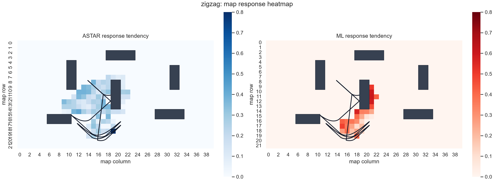
Fig.9 Zigzag-route response map showing repeated turning pressure across the arena

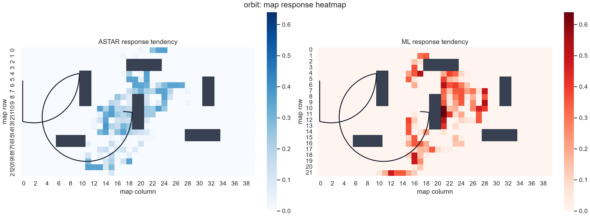
Fig.10 Orbit-route response map showing how the learned policy distributes local reactions around the arena

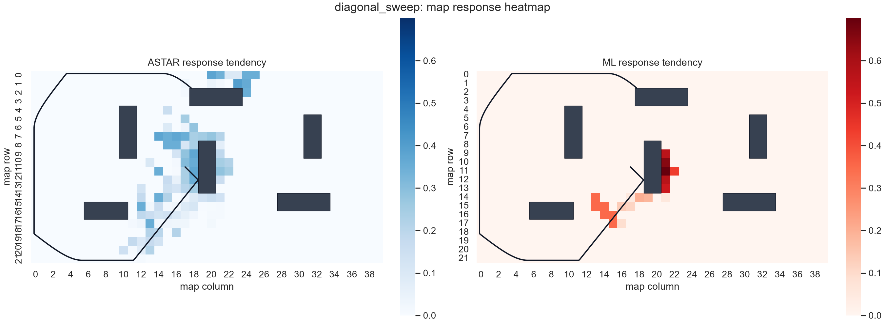
Fig.11 Diagonal-sweep response map showing the held-out route used for generalisation checks

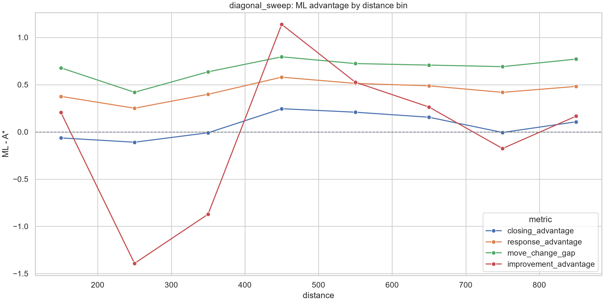
Fig.12 Diagonal-sweep distance curve highlighting where the held-out route favors either strategy

| route | A* avg distance | ML avg distance | A* caught | ML caught | A* closing | ML closing |
| --- | ---: | ---: | ---: | ---: | ---: | ---: |
| `box` | 434.94 | 470.47 | 9 | 4 | 0.444 | 0.494 |
| `zigzag` | 225.88 | 320.76 | 37 | 4 | 0.492 | 0.484 |
| `orbit` | 416.51 | 432.92 | 9 | 0 | 0.405 | 0.406 |
| `diagonal_sweep` | 461.03 | 503.25 | 12 | 0 | 0.396 | 0.467 |

The result supported the same conclusion: ML often creates more visible local pressure, but A* remains more reliable when the goal is consistent capture.

## 2026-06-18 20:20 - held-out map testing

The project then tested A* and ML across several map types: `sparse_blocks`, `corridor_gates`, `dense_blocks`, and `narrow_passages`. This made the comparison more honest because a good route result does not guarantee good map generalization.

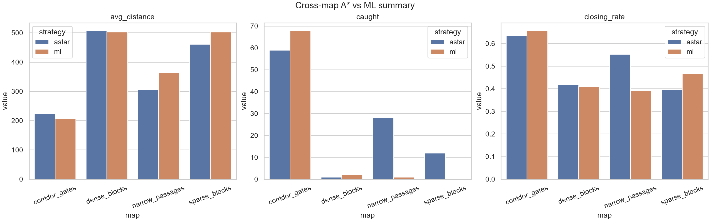
Fig.13 Cross-map summary comparing average distance, catches, and closing rate

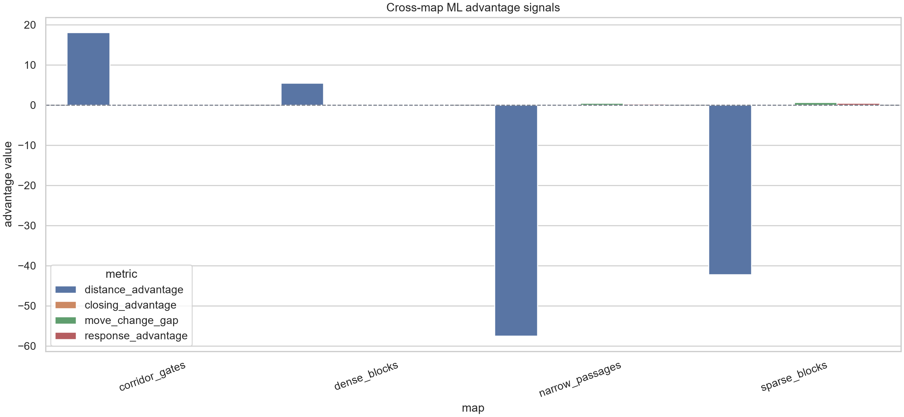
Fig.14 Cross-map advantage bars summarizing where ML wins or loses by metric

| map | A* avg distance | ML avg distance | A* caught | ML caught | A* closing | ML closing | ML agreement |
| --- | ---: | ---: | ---: | ---: | ---: | ---: | ---: |
| `sparse_blocks` | 461.03 | 503.25 | 12 | 0 | 0.396 | 0.467 | 0.449 |
| `corridor_gates` | 224.22 | 206.11 | 59 | 68 | 0.634 | 0.658 | 0.923 |
| `dense_blocks` | 508.29 | 502.77 | 1 | 2 | 0.419 | 0.411 | 0.919 |
| `narrow_passages` | 305.91 | 363.43 | 28 | 1 | 0.553 | 0.392 | 0.458 |

The clearest win for ML was `corridor_gates`, where it achieved lower average distance and more catches than A*. The clearest loss was `narrow_passages`, where A* stayed stronger because long-wall navigation needs global planning.

The response-map group below makes the map difference more visible. `sparse_blocks` leaves more open space, `corridor_gates` creates repeated gate-like decisions, `dense_blocks` creates small local traps, and `narrow_passages` demands longer global routing around walls.

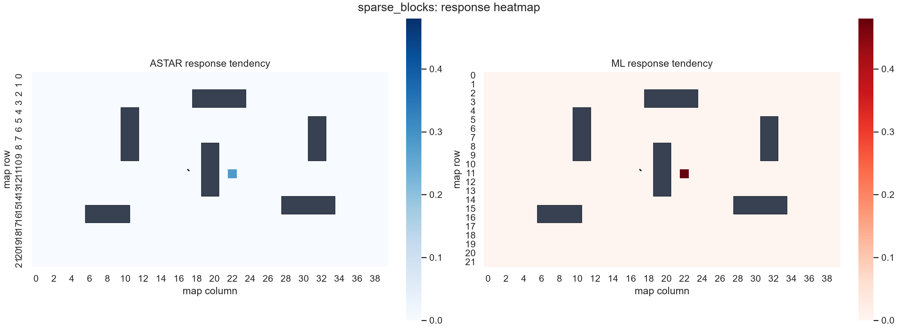
Fig.15 Sparse-block response map showing an open layout where ML can create pressure but struggles to finish captures (sight is blocked)

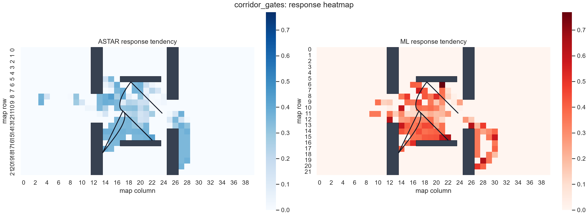
Fig.16 Corridor-gates response map showing the strongest current advantage zone for the learned policy

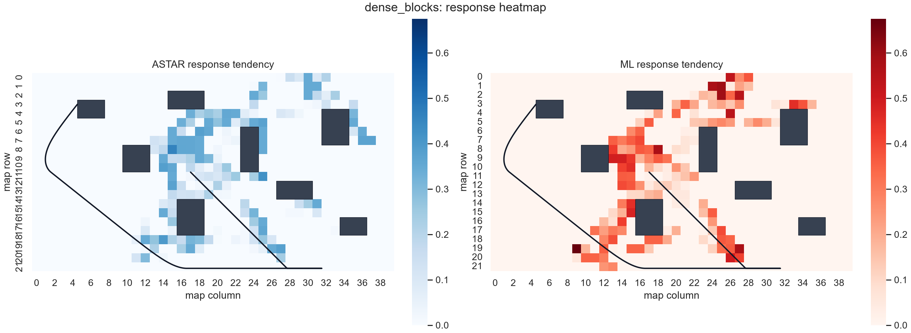
Fig.17 Dense-block response map showing local obstacle clutter where both strategies become less decisive

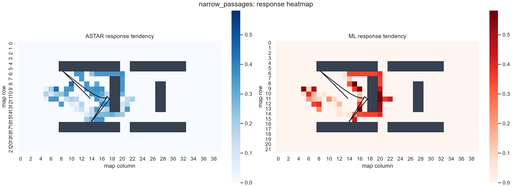
Fig.18 Narrow-passages response map showing the layout where global planning becomes most important

The metric-bar group then puts the same four maps into a compact numeric comparison. This makes it easier to separate a visual impression from the actual distance, capture, and closing-rate results.

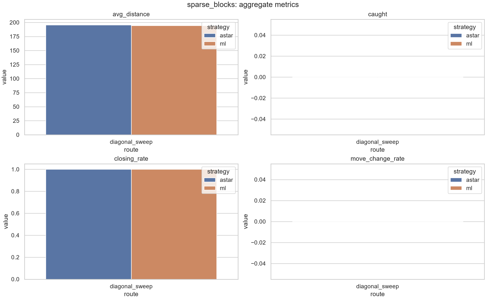
Fig.19 Sparse-block metric bars showing ML's pressure without reliable capture conversion

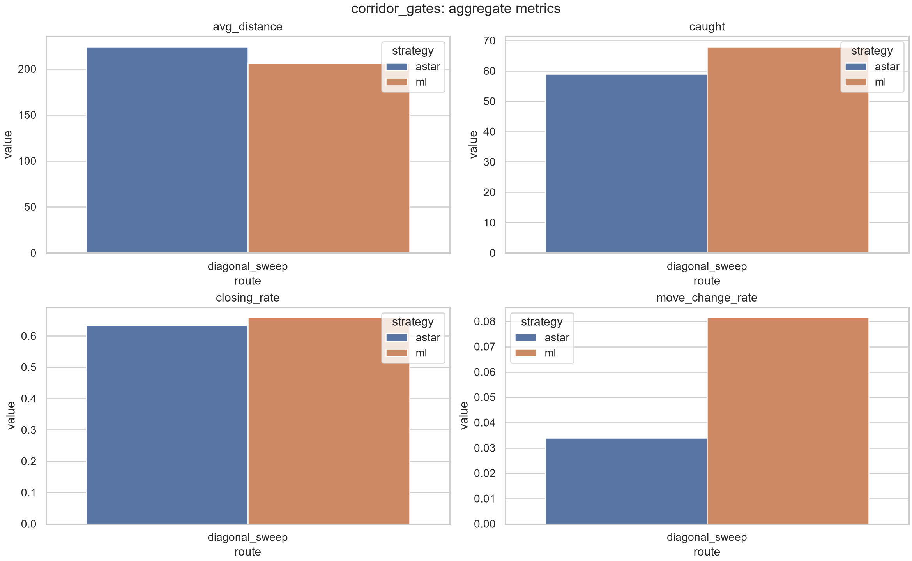
Fig.20 Corridor-gates metric bars showing the clearest current ML advantage

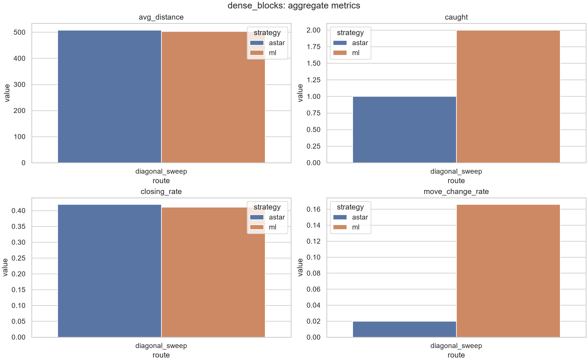
Fig.21 Dense-block metric bars showing that both strategies struggle, while ML remains competitive

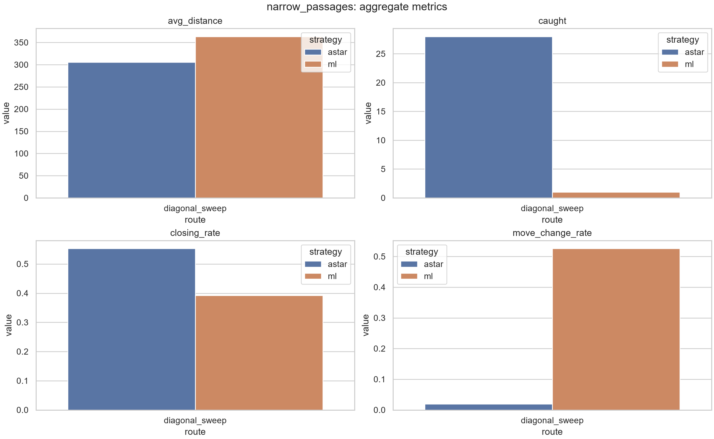
Fig.22 Narrow-passages metric bars confirming that A* is stronger when long-wall planning dominates

## 2026-06-18 21:56 - imitation diagnostics added

The next analysis pass used imitation-learning concepts more directly. The current ML policy is still a behavior-cloning style model, so the new figures inspect three risks: action mismatch against the A\* teacher, distance drift after mismatch, and state-density differences between ML and A\*.

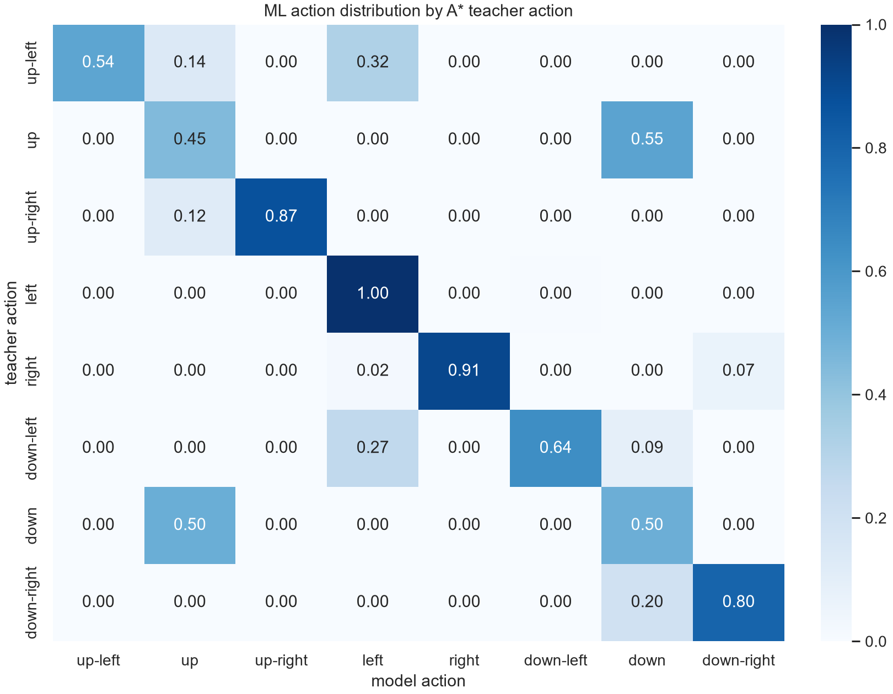
Fig.23 The confusion matrix exposes which teacher actions are copied well and which actions get redirected

The matrix shows that several diagonal and side movements are copied cleanly, while some vertical actions are split across neighboring actions. This is useful because raw agreement only gives one number, but the matrix shows the shape of the mistake.

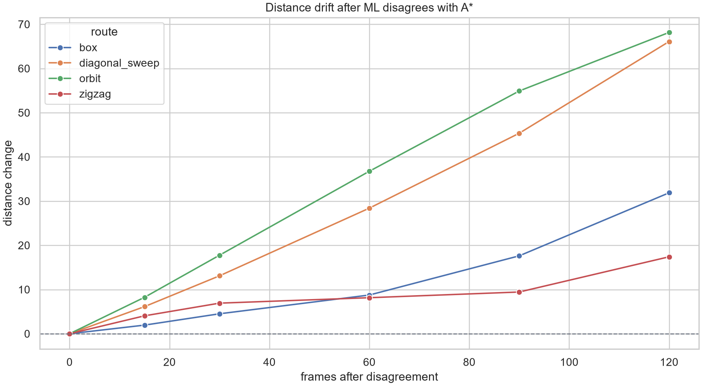
Fig.24 The compounding error curve tracks distance drift after an ML disagreement with A*

The disagreement curve is the clearest behavior-cloning warning. After a mismatch, distance generally drifts upward over the next 120 frames, especially on `orbit` and `diagonal_sweep`. That means the next improvement should add learner-state relabeling, where ML runs first and A* labels the states that ML actually reaches.

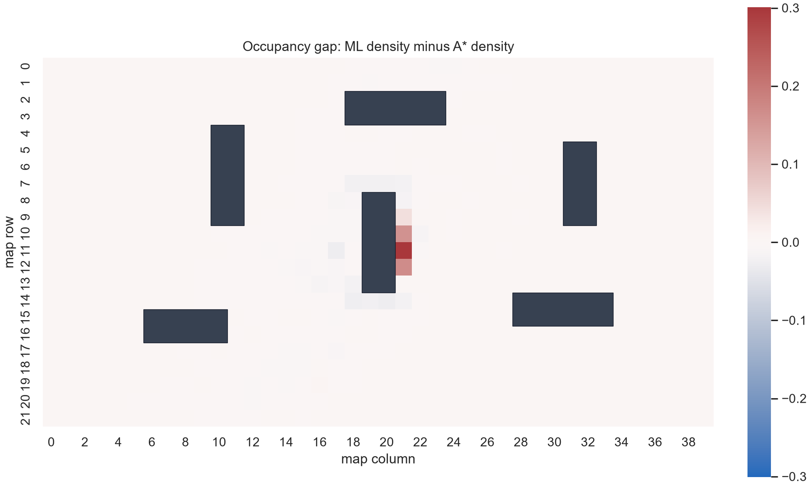
Fig.25 The occupancy gap heatmap shows where ML state density is higher or lower than A* state density

This plot borrows the distribution view behind GAIL without implementing a discriminator. Red regions mean ML spends more time there than A*, and blue regions mean A* spends more time there. The current gap is concentrated around the central obstacle region, which matches the idea that ML is learning a local reaction style rather than a full global planner.

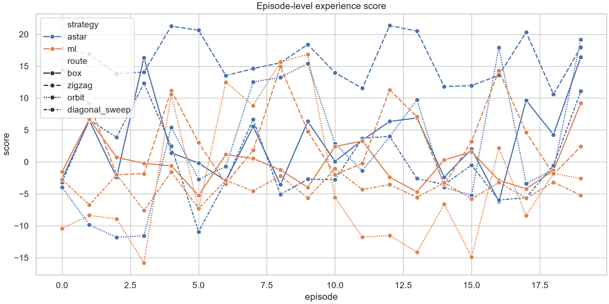
Fig.26 The experience score curve combines pressure, capture, distance improvement, and action-change cost

The score curve is not a training reward. It is an evaluation score for comparing feel across episodes. A* still has stronger stable peaks, while ML has isolated competitive moments where local pressure is useful but not consistently converted into capture.

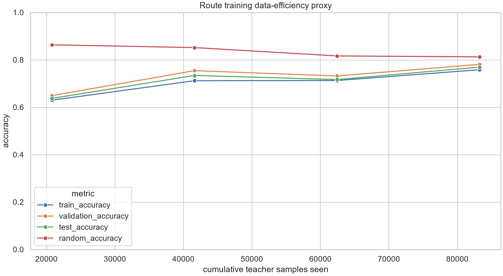
Fig.27 The data-efficiency proxy shows accuracy against cumulative teacher samples seen during route training

The route-training curve shows validation and test accuracy improving from the baseline iteration, while random-map accuracy slowly declines. That is why the deploy model was selected before the strongest route-only model: the route-best model gained route accuracy but lost too much broad-map behavior.

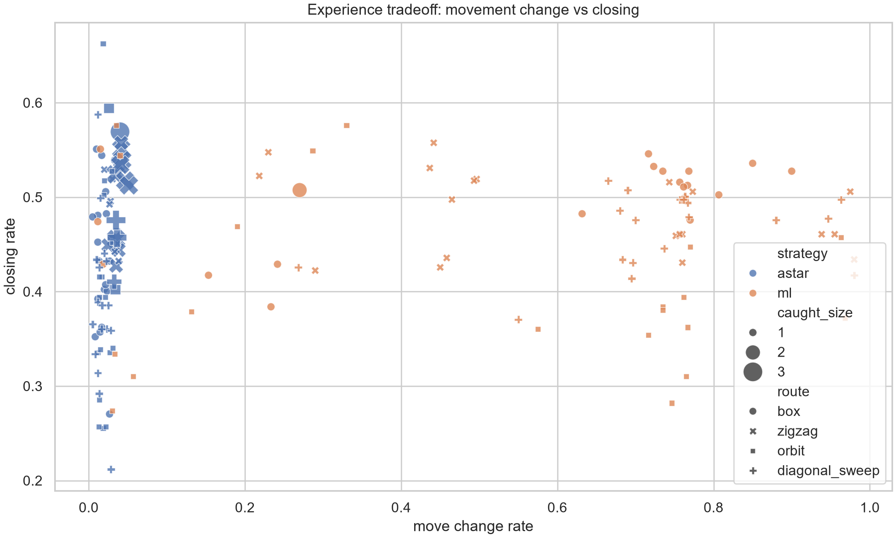
Fig.28 The Pareto scatter compares movement change and closing rate across routes and strategies

The Pareto view makes the experience difference easy to see. A* clusters at low movement change, while ML spreads across much higher movement-change values. This supports the current conclusion: ML is useful as a more reactive pressure style, but A* remains the safer reliable-capture controller.
